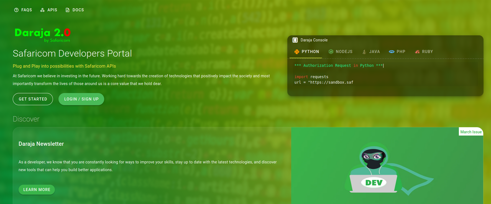
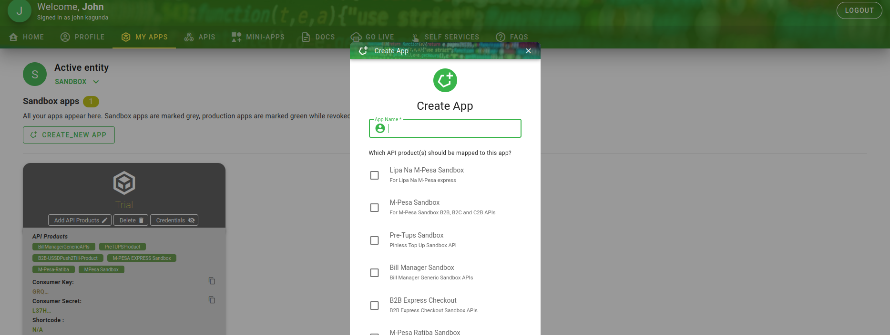
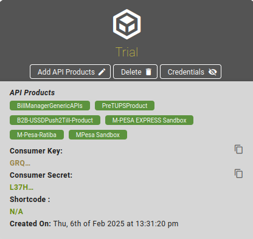
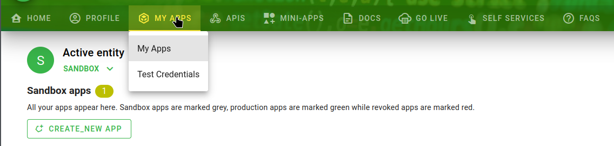
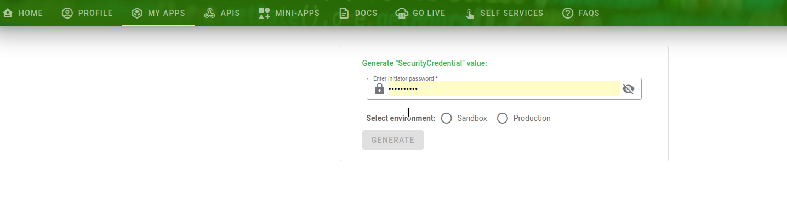

## Overview

This guide walks you through the credentials mpesakit needs, where to find them on the Safaricom developer portal, and how to store them safely for development and production. I’ll point out the typical sandbox values used for local testing and show a quick example of how to set them as environment variables.

> Quick reminder: never commit real credentials to source control. Use secrets management for production and rotate/revoke keys if they are exposed.

## What each credential is (and common dev values)

Here are the common fields mpesakit expects and what they mean:

| mpesa credential name | What it is | Example / common dev value |
|---|---|---|
| `SHORTCODE` | Paybill or BuyGoods Till shortcode used for transactions | `174379` |
| `PASSKEY` | Passkey used in STK Push / password generation | `bfb279f9aa9bdbcf158e97dd71a467cd2e0c893059b10f78e6b72ada1ed2c919` |
| `PASSWORD` | Base64-encoded password (shortcode+passkey+timestamp) | `MTc0Mzc5YmZiMjc5ZjlhYTliZGJjZjE1OGU5N2RkNzFhNDY3Y2QyZTBjODkzMDU5YjEwZjc4ZTZiNzJhZGExZWQyYzkxOTIwMTYwMjE2MTY1NjI3`  |
| `TIMESTAMP` | Timestamp used when generating the password | `20250806143644` |
| `SECURITY_CREDENTIAL` | Encrypted security credential for B2B/B2C (encrypt with Safaricom public key) | Obtain from portal |
| `MPESA_CONSUMER_KEY` | OAuth consumer key (client ID) used to get access tokens | Obtain from portal |
| `MPESA_CONSUMER_SECRET` | OAuth consumer secret (client secret) used to get access tokens | Obtain from portal |

## Prerequisites

- A registered developer account on [https://developer.safaricom.co.ke](https://developer.safaricom.co.ke)
- Access to the "My Apps" section of the portal for the sandbox or production environment you need.

## Steps — in plain language

1. Create your developer account at [https://developer.safaricom.co.ke](https://developer.safaricom.co.ke).
      

2. Create an app from the "My Apps" tab.
      - Give it a name and enable the APIs you need.
      
      - Tip: checking the API boxes enables those APIs for this specific app.

3. Get the Consumer Key and Consumer Secret.
      - Open your app details and copy the Consumer Key and Consumer Secret to a secure place (password manager or secrets store).

      

4. Generate or retrieve the SecurityCredential.
      - In "My Apps", open the dropdown and choose "Test Credentials" to create sandbox or production SecurityCredential entries.

      

      

      - The SecurityCredential is an encrypted value you’ll use for certain B2B/B2C operations.

5. Obtain the PassKey.
      - Sandbox passkeys are available in the portal for test apps.
      - Production PassKey is provided once your till/Paybill has been approved.

## Example: environment variables for local development

Set these in your local .env or your secrets manager (never commit .env with real values):

```text
MPESA_CONSUMER_KEY=your_consumer_key_here
MPESA_CONSUMER_SECRET=your_consumer_secret_here
SHORTCODE=174379
PASSKEY=bfb279f9aa9...
TIMESTAMP=20250806143644
PASSWORD=Base64Encoded(shortcode+passkey+timestamp)
SECURITY_CREDENTIAL=encrypted_value_from_portal
```

> ℹ️ Info: If you don't have the `PASSWORD`, don't worry — it can be generated as long as you have the `SHORTCODE`, `PASSKEY`. The `PASSWORD` is the Base64 encoding of (SHORTCODE + PASSKEY + TIMESTAMP).

## Notes & best practices

- Use the sandbox values only for local development and testing.
- In production, store secrets in a vault (AWS Secrets Manager, Azure Key Vault, etc.) and inject them via CI/CD or runtime secret mounts.
- Rotate credentials regularly and revoke any keys that may have been exposed.
